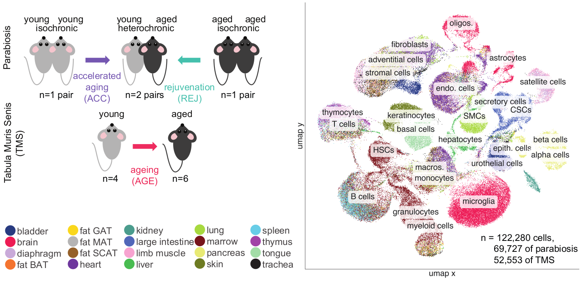

  

# Parabiosis
The repository contains jupyter notebooks descripbing downstream analyses of the "Molecular hallmarks of heterochronic parabiosis at single cell resolution". Notebooks describe quality control, batch correction, cell type annotation and differential gene expression steps starting from the raw, unfiltered, aligned count matrices.
